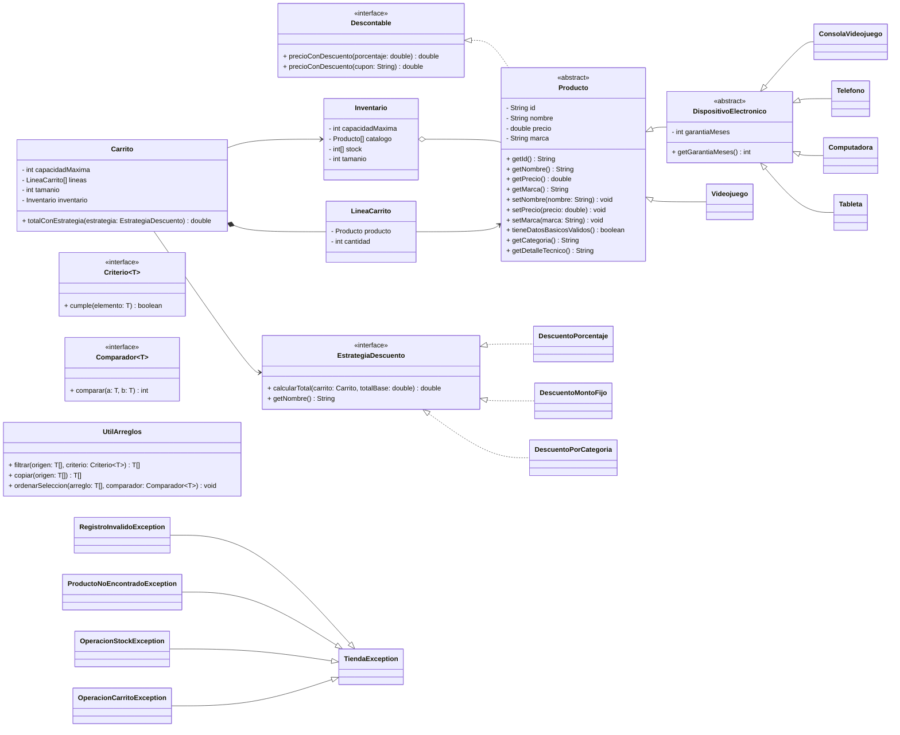

# Unidad V - Practica: Tienda Electronica, Interfaces y Excepciones

En esta practica se integran los fundamentos de Programacion Orientada a Objetos para modelar y resolver el caso de una tienda electronica, aplicando encapsulamiento, herencia, polimorfismo, clases abstractas, interfaces, arreglos, genericidad y manejo de excepciones.

## Objetivo

Desarrollar un sistema orientado a objetos para administrar una tienda de productos tecnologicos y videojuegos. El sistema debe permitir registrar productos de distintas categorias, gestionar existencias, operar un carrito de compras, aplicar descuentos (incluyendo estrategias de promocion), buscar y filtrar articulos, ordenar el catalogo y manejar errores mediante excepciones de dominio.

## Requisitos funcionales

### 1) Jerarquia de productos

- Clase abstracta `Producto` con atributos base:
    - `id`
    - `nombre`
    - `precio`
    - `marca`
- Interfaz `Descontable` implementada por `Producto`.
- Clase abstracta `DispositivoElectronico` como nivel intermedio para productos de hardware.
- Subclases concretas:
    - `Videojuego`
    - `ConsolaVideojuego`
    - `Telefono`
    - `Computadora`
    - `Tableta`
- Cada subclase debe sobrescribir:
    - `getCategoria()`
    - `getDetalleTecnico()`
- Deben existir validaciones basicas para texto no vacio y precio no negativo.
- Deben existir descuentos por porcentaje y por cupon.

### 2) Inventario con arreglos

- El inventario debe almacenar productos y existencias usando arreglos.
- El constructor define la capacidad maxima de productos distintos.
- Debe permitir:
    - registrar productos
    - consultar existencias
    - verificar stock disponible
    - retirar stock
    - reabastecer stock
    - obtener productos por ID
- Debe incluir operaciones de consulta para el catalogo:
    - buscar por ID
    - buscar por nombre parcial
    - filtrar por categoria
    - filtrar por rango de precio
    - ordenar por nombre
    - ordenar por precio ascendente o descendente

### 3) Carrito con arreglos

- El carrito debe asociarse a un inventario.
- Debe almacenar sus lineas usando arreglos.
- El constructor define la capacidad maxima de lineas distintas.
- Debe permitir:
    - agregar productos por ID
    - agregar productos por objeto
    - eliminar productos del carrito
    - consultar cantidades por producto
    - calcular total sin descuento
    - calcular total con descuento por porcentaje
    - calcular total con descuento por cupon
    - calcular total con estrategia de descuento
    - mostrar el contenido del carrito

### 4) Motor de descuentos por estrategia (nivel intermedio)

- Debe existir la interfaz `EstrategiaDescuento` para aplicar promociones sin modificar la logica principal del carrito.
- Deben existir implementaciones concretas de estrategia:
    - `DescuentoPorcentaje`
    - `DescuentoMontoFijo`
    - `DescuentoPorCategoria`
- El carrito debe exponer el metodo `totalConEstrategia(EstrategiaDescuento estrategia)`.
- Las estrategias no deben generar totales negativos.

### 5) Genericidad sin colecciones dinamicas

- Deben existir interfaces genericas para trabajar con arreglos:
    - `Criterio<T>` para filtrar elementos
    - `Comparador<T>` para ordenar elementos
- Debe existir una clase utilitaria `UtilArreglos` con operaciones genericas sobre arreglos.
- El algoritmo de ordenamiento utilizado es seleccion directa (`selection sort`).

### 6) Manejo de excepciones

- Debe existir una jerarquia de excepciones de dominio:
    - `TiendaException`
    - `RegistroInvalidoException`
    - `ProductoNoEncontradoException`
    - `OperacionStockException`
    - `OperacionCarritoException`
- Las operaciones criticas deben contar con una version que lance excepciones (`OrThrow`) para reportar la causa exacta del error.
- Tambien pueden existir versiones que devuelvan `boolean` cuando solo se requiere saber si la operacion tuvo exito o fracaso.

### 7) Interfaz de consola

- El sistema debe contar con un menu interactivo para:
    - registrar productos
    - listar el catalogo
    - reabastecer stock
    - retirar stock
    - agregar y eliminar productos del carrito
    - visualizar el carrito
    - calcular totales con y sin descuento
    - buscar productos
    - filtrar el catalogo
    - ordenar el catalogo

## Estructura general

- `logica/`
    Contiene las clases del dominio, las abstracciones, las utilidades genericas y las excepciones.
- `interfaz/`
    Contiene las clases de entrada y el menu interactivo de consola.
- `miPrincipal/`
    Contiene la clase principal para ejecutar la aplicacion.
- `miTest/`
    Contiene las pruebas unitarias del proyecto.

## Diagrama de clases

[Editor en linea](https://mermaid.live/)

Nota: en Mermaid, la genericidad se representa como `~T~` (por ejemplo, `Criterio~T~`).
En codigo Java, esa misma genericidad se escribe como `<T>` (por ejemplo, `Criterio<T>`).



## Uso del proyecto con make

### Default - Compilar + Probar + Ejecutar

```bash
make
```

### Compilar

```bash
make compile
```

### Probar todo

```bash
make test
```

### Ejecutar app

```bash
make run
```

### Limpiar binarios

```bash
make clean
```

## Compilacion manual

```bash
find ./ -type f -name "*.java" > compfiles.txt
javac -encoding utf-8 -d build -cp lib/junit-platform-console-standalone-1.5.2.jar @compfiles.txt
```

## Ejecucion manual de pruebas

```bash
java -jar lib/junit-platform-console-standalone-1.5.2.jar --class-path build --scan-class-path
```

## Ejecucion manual de la aplicacion

```bash
java -cp build miPrincipal.Principal
```
